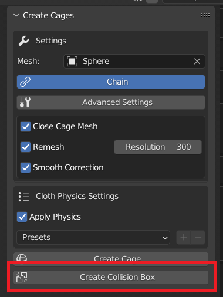

Cage Modes
===================================

In this section we list the different modes available on Simplicage.

Single Bone Mode
-----------

The default mode creates a cage for each of the selected bones.

For instance, if we select one bone we obtain the single cage for the selected bone.

.. image:: images/single_selection.png
   :width: 300

While selecting more bones, the addon will create a cage for each selected bone.

.. image:: images/no_chain_multiple_selection.png
   :width: 300

Chain Mode
-----------

.. image:: images/cage.png
   :width: 300

This mode will generate a unique cage for the selected bones, instead of one for each bone.

.. image:: images/chain_multiple_selection.png
   :width: 300

.. note::
   If only one bone is selected, *Chain* mode will be automatically disabled when you generate the cage.

Collision Box
-----------

This mode will create a collision box instead of a cage for physics. This means that cages will collide with this collision box.

.. note::
   This mode can be used with *Chain*. Similarly to cages, if *Chain* is disabled, one collision box will be generated for each bone; if *Chain* is enabled, the collision box will be generated merging the contribution of all the selected bones.

Clicking on the generate collision box, we can also change the collision settings in the object Physics Options.

.. image:: images/collision_settings.png
   :width: 300
