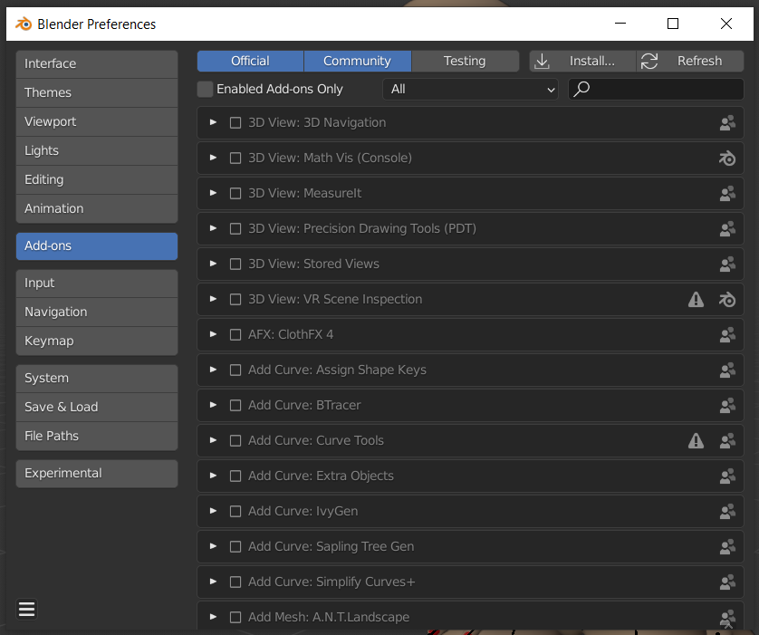

Installation
===================================

In this section you will be guided in the process of installing Simplicage as an add-on.

.. warning::
    Before proceeding with the installation, `be sure to install the latest Blender version <https://www.blender.org/download/>`_.
    
    In particular, the addon is compatible with Blender 3.0.x or newest versions.
    We can not provide any support for installing Simplicage on earlier versions.

Procedure
--------

#. Open Blender *Settings*.

    .. image:: images/simplicage_install_01.png
       :width: 300

#. Open the *Add-on* tab and click on the *Install...* button.

#. Select the file *Simplicage.zip*.
    .. warning::
        Do not unpack the .zip file before installing the addon. Select directly the file you download.

#. In the Setting window it should now appear the Simplicage addon. *Enable it* clicking on the check button.

    .. image:: images/simplicage_install_03.png
       :width: 300

#. Restart Blender.

#. You can now start using the addon.
    Go in Viewport and press N: you will enable the tabs on the right as in the image.
    Search for Simplicage and start using the addon!

    .. image:: images/simplicage_install_04.png
       :width: 300

Updating
--------
 
If you are updating the add-on, please follow again the guide before. Be sure to restart Blender before using the new version of the add-on.

.. info::
    While updating, the Setting window might not automatically select Simplicage.
    Simply search for Simplicage with the search field to quickly find the new version of the add-on, and check if it is enabled.
