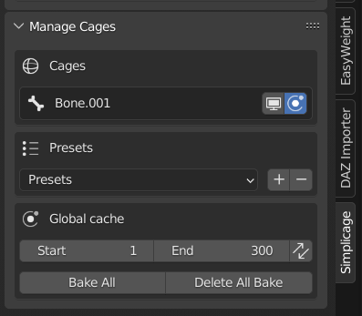

Manage Cages
===================================

In this window you can manage the cages/collision boxes that are on the scene.

.. note::
  This window is available only if at least one cage/collision box is available on the scene.

Cages
*********

This part lists all the cages available on the scene.

With the buttons you can show/hide in viewport (by default cages are always hidden in Render), and enable/disable physics simulation, each cage/collision box independently. Moreover, the *X* button deletes the cage from the scene and its mesh data.

Presets
*********

In this section, you can change the preset **for the selected cage**. See :ref:`Cloth Physics Settings<Cloth Physics Settings>` for more informations about how to create or delete presets.

Global Cache
*********

In this section you can bake the physics for all available cages. You can choose the initial and final frame, and with the double arrow button you can synchronise those values with the current initial and final animation frames values.

.. note::
  All generated cages will consider these values as initial and final frames for physics computation. Changing these values will change the value of all Simplicage cages, but not other physics objects you have in the scene.

.. warning::
  Before chaging intial/final frame values or baking, it is advised to Delete All Bake. This will prevent issues related to already baked cages.
