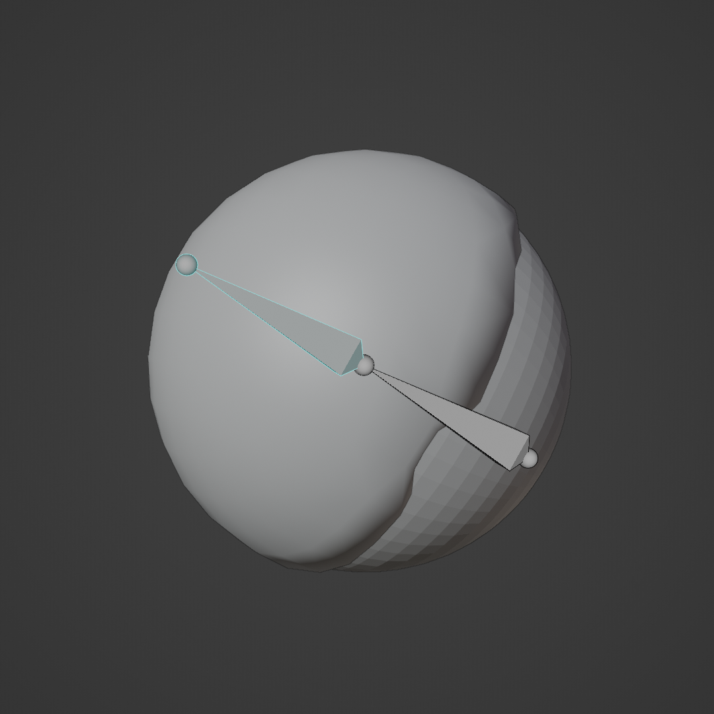
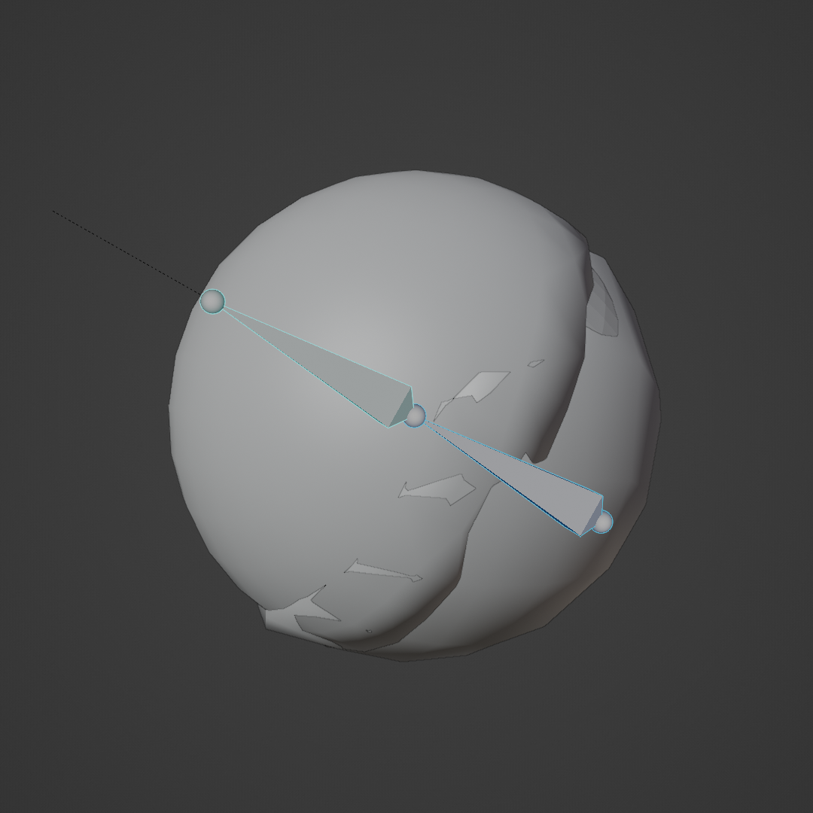
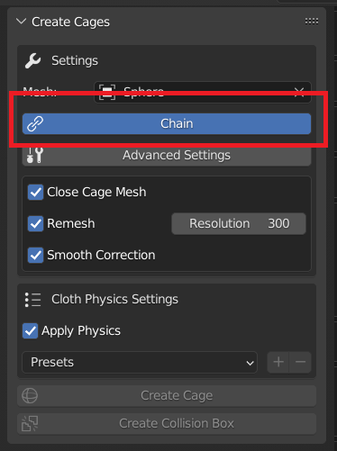
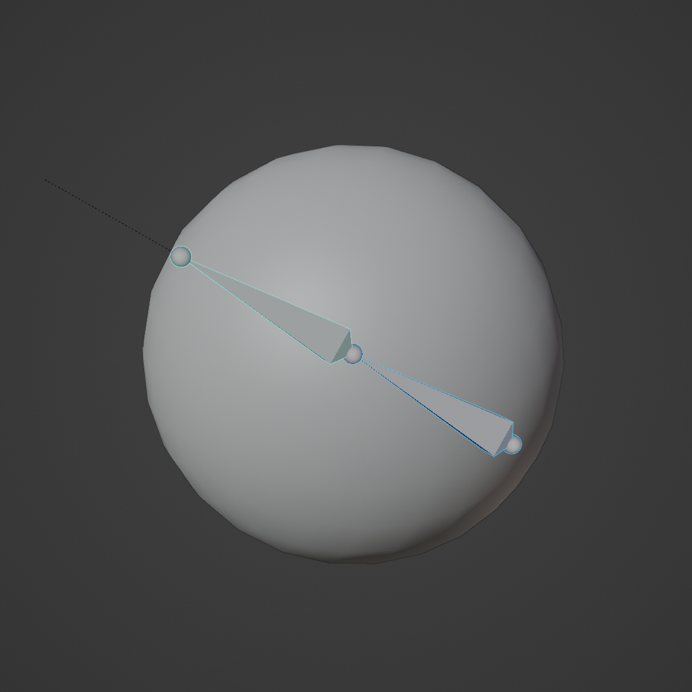

Modes
===================================

In this section we list the different modes available on Simplicage.

Single Bone Mode
-----------

The default mode creates a cage for each of the selected bones.

For instance, if we select one bone we obtain the single cage for the selected bone.

While selecting more bones, the addon will create a cage for each selected bone.

Chain Mode
-----------

This mode will generate a unique cage for the selected bones, instead of one for each bone.

