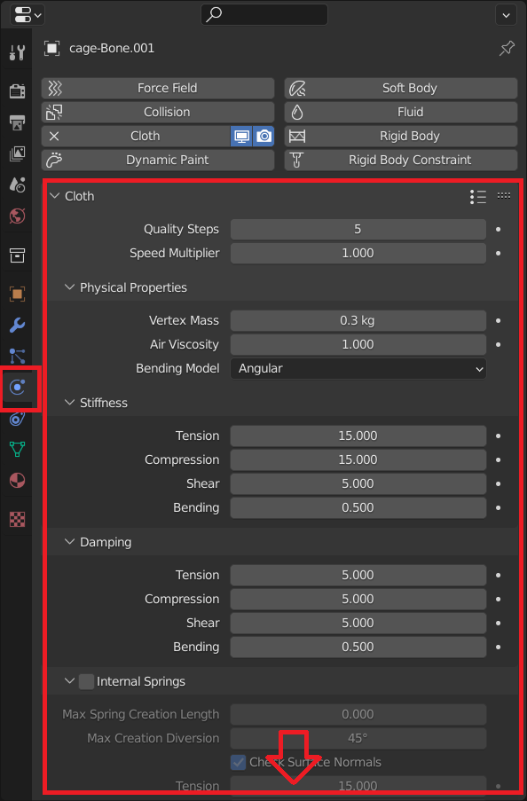
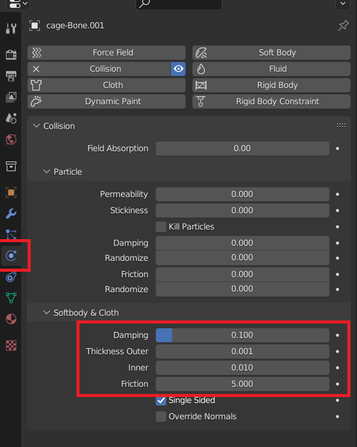

Modes
===================================

Cage Modes
*********

In this section we list the different cage modes available on Simplicage. Note that you might see less modes depending on the version you are using. Check the documentation part on :ref:`Versions<Versions>` for more information.

Select one option to choose the method with with you want to select the region to generate the cage from.

Single Bone
-----------

The Single Bone mode creates a cage for each of the selected bones.

For instance, if we select one bone we obtain the single cage for the selected bone.

.. image:: images/single_selection.png
   :width: 300

While selecting more bones, the addon will create a cage for each selected bone.

.. image:: images/no_chain_multiple_selection.png
   :width: 300

Chain (Lite Version and Pro Version)
-----------

This mode generates a unique cage for the selected bones, instead of one for each bone.

.. image:: images/chain_multiple_selection.png
   :width: 300

.. note::
   If only one bone is selected, *Chain* mode will be automatically disabled when you generate the cage.

Vertex Group (Pro Version)
-----------

This mode generates a cage from the Vertex Group of the Mesh object selected. This mode works also on Objects that are not driven by an Armature.

Physics Modes
*********

In this section we list the different Physics modes available on Simplicage.
Select one option to choose which kind of physics to apply to the cage.

None
-----------

In this mode, a cage without physics is generated.

Cloth
-----------

In this mode, a cage with cloth physics is generated. It will also be bound to the Mesh from which it has been created.

Clicking on the generate cage, we can also change the cloth physics settings in the object Physics Options.

Collision Box
-----------

This mode will create a collision box instead of a cage for physics. This means that cages will collide with this collision box.

Clicking on the generated collision box, we can also change the collision settings in the object Physics Options.

